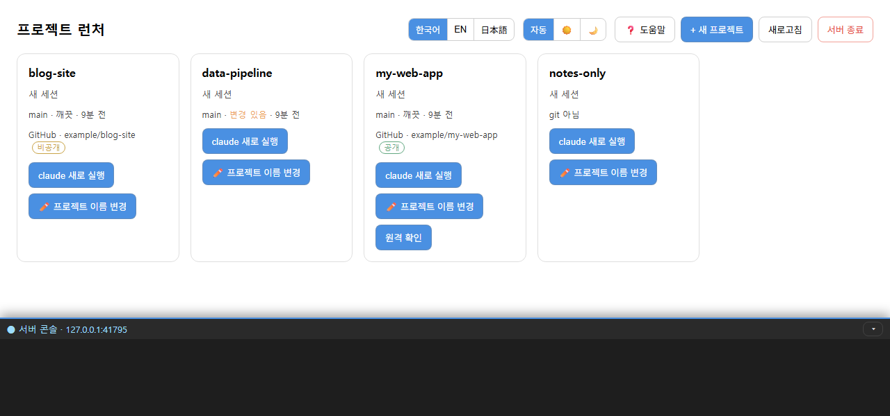

# Claude WSL Launcher

[한국어](README.md) · [English](README.en.md) · **日本語**

`~/projects` 配下のプロジェクトをカードで表示し、クリック一つでそのフォルダーから **Claude Code(`claude`)を新しい WSL ウィンドウ**で起動する小さなローカルダッシュボードです。Windows + WSL2 専用。



## クイックスタート

> ⚠️ 以下のコマンドはすべて **WSL(Ubuntu)ターミナル**の中で実行してください。PowerShell やコマンドプロンプトではありません。(スタートメニューで「Ubuntu」を検索)

```bash
cd ~ && git clone https://github.com/GojoSuperman/claude-wsl-launcher.git && cd claude-wsl-launcher
bash scripts/setup.sh
```

`setup.sh` が Node・claude・依存関係を点検し、足りないものは確認のうえインストールし、デスクトップのショートカットまで作ります。終わったら**ショートカットをダブルクリック**してください(Chrome があればアドレスバーのないアプリ風ウィンドウ、なければ既定のブラウザで開きます。または `npm start` して http://127.0.0.1:41730)。

- スキャンするフォルダーの既定は `~/projects` です。別のフォルダーにするには `PROJECTS_ROOT=~/dev bash scripts/setup.sh`。
- 一段階ずつ確認しながら進めたい場合 → **[セットアップガイド](docs/SETUP.ja.md)**

## 動作要件

| 必須 | 理由 |
|---|---|
| **Windows 10/11 + WSL2** | `wsl.exe`・`powershell.exe` でウィンドウを開くため → macOS・ネイティブ Linux は非対応 |
| WSL 内の **Node.js 20 以上** | サーバーの実行(無ければ `setup.sh` が nvm でのインストールを提案) |
| WSL 内の **Claude Code CLI** | このツールが起動する対象(無ければ `setup.sh` がインストールを提案) |

| 任意 | 用途 |
|---|---|
| **GitHub CLI(`gh`)** ログイン済み | カードの公開/非公開バッジ表示と、「プロジェクト名変更」で GitHub リポジトリ名も一緒に変える場合 |

ディストリビューション名・ホーム・デスクトップのパスは**実行時に検出**するため、PC ごとの設定は不要です。

## 機能

- **カード一覧**: フォルダーごとに git ブランチ・変更の有無・最終コミット時刻、「実行中」バッジ、「履歴あり / 新規セッション」を表示。
- **claude 起動**: そのフォルダーで**新しい WSL ウィンドウ**に claude(履歴があれば `--continue`)。WSL ネイティブ起動なので「このフォルダーを信頼しますか?」の再質問が出ません。
- **リモート確認 / 取得**: `git fetch` 後、遅れていれば `git pull --ff-only`。
- **新規プロジェクト**: `~/projects/<名前>` を作成して `git init`。
- **プロジェクト名変更**: フォルダー名を変更し、claude の履歴フォルダーも一緒に移動(`--continue` 維持)。origin が GitHub なら `gh repo rename` でリポジトリ名と remote URL も更新(gh ログインが必要。失敗してもローカルは変更され警告を表示)。実行中のプロジェクトとこのツール自身のフォルダーではボタンが無効。
- **名前の規則**: 新規作成・名前変更とも英数字・`-`・`_`・`.` のみ(GitHub リポジトリの規則)。
- **GitHub 公開/非公開バッジ**: origin が GitHub のカードに `owner/repo` と**公開/非公開**バッジ(gh ログイン時。無い場合は `?`)。
- **ライト/ダークテーマ**: ヘッダーで 自動(Windows 設定に従う)・☀️・🌙 を切替(記憶されます)。
- **サーバーコンソール(下部パネル)**: このサーバーのログをリアルタイム表示(読み取り専用)。
- **自動停止**: ダッシュボードのウィンドウを閉じると約 10 秒後にサーバーが自動停止(`AUTO_SHUTDOWN=0` で無効)。ヘッダーの**サーバー停止**ボタンで即時停止も可能。
- **多言語**: 한국어 · English · 日本語(記憶されます)。**アプリ内ヘルプ**: `❓ ヘルプ` ボタンまたは `?` キー。
- **ポート自動フォールバック**: 既定の `41730` が使用中なら `41731`〜`41739` へ。`PORT=5000 npm start` で指定可能。

## なぜこのツールか

claude は **WSL ネイティブのパス**(`~/projects/...`、ext4)から起動してこそ正しく・速く動きます。Windows エクスプローラーで `\\wsl.localhost\...` に入ってそこから起動すると罠にはまります:

- 「このフォルダーを信頼しますか?」が繰り返し出る
- claude の Bash が **Windows の Git Bash** で動き、Linux の `node_modules` バイナリと衝突する
- セッションログが Windows 側(`C:\...`)に別途たまる
- 境界をまたぐファイル I/O(`npm install`・`git status` など)が **5〜10 倍遅い**

このツールは、毎回ターミナルで `cd … && claude` と打つ代わりに、**常に正しいネイティブ WSL ウィンドウ**でワンクリック起動してこれらの罠を避けます。

## 仕組み

- ブラウザだけでは PC のプロセスを起動できないため、**WSL 内で動く小さなローカルサーバー**(Express)が代わりに行います。
- サーバーは `~/projects` をスキャンし、git 状態を取得し、`powershell.exe` で `Start-Process wsl.exe` を呼んで**新しい WSL ウィンドウ**に claude を起動します。
- サーバーは自身の `stdout/stderr` を `/ws/console` WebSocket に流して下部パネルに表示します。その接続がすべて切れると猶予後に自動停止します。

## セキュリティ

- **`127.0.0.1`(localhost)専用バインド — 外部に公開しないでください。** 認証がなくコマンドを実行するため、外部に開くと任意コマンド実行の危険があります。
- クライアントはプロジェクト**名のみ**送信 → サーバーが `~/projects` 内の実パスに再構成・検証(`/`・`..`・改行・NUL を拒否)。
- **個人用ローカルユーティリティ**です。マルチユーザー・リモート用途ではありません。

## 問題が起きたら

```bash
bash scripts/doctor.sh        # 診断のみ
bash scripts/doctor.sh --fix  # 確認のうえ自動修正
```

WSL・Node・claude・改行コード(CRLF)・依存関係を点検し、直すべきコマンドを表示します。詳しくは[セットアップガイドのトラブルシューティング](docs/SETUP.ja.md#6-トラブルシューティング)を参照。

## テスト

```bash
npm test
```

## ライセンス

[MIT](LICENSE)
