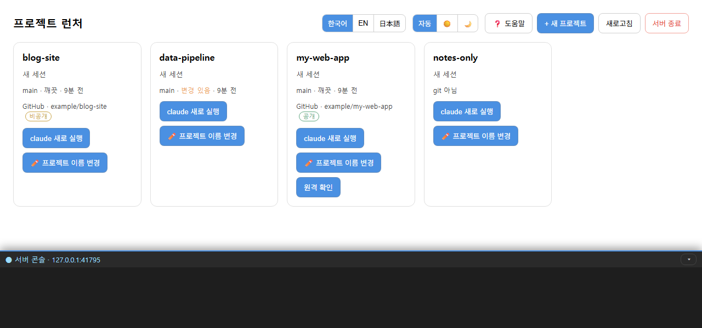

# Claude WSL Launcher

**한국어** · [English](README.en.md) · [日本語](README.ja.md)

`~/projects` 아래 프로젝트들을 카드로 보여주고, 클릭 한 번으로 그 폴더에서 **Claude Code(`claude`)를 새 WSL 창**에 띄우는 작은 로컬 대시보드입니다. Windows + WSL2 전용.



## 빠른 시작

> ⚠️ 아래 명령은 전부 **WSL(우분투) 터미널** 안에서 실행하세요. PowerShell·명령 프롬프트가 아닙니다. (시작 메뉴에서 "Ubuntu" 검색)

```bash
cd ~ && git clone https://github.com/GojoSuperman/claude-wsl-launcher.git && cd claude-wsl-launcher
bash scripts/setup.sh
```

`setup.sh` 가 Node·claude·의존성을 점검해 빠진 것은 물어보고 설치하고, 바탕화면 단축키까지 만들어 줍니다. 끝나면 **단축키를 더블클릭**하세요 (Chrome 이 있으면 주소창 없는 앱 창으로, 없으면 기본 브라우저로 열립니다. 또는 `npm start` 후 http://127.0.0.1:41730).

- 스캔 폴더 기본값은 `~/projects` 입니다. 다른 폴더를 쓰려면 `PROJECTS_ROOT=~/dev bash scripts/setup.sh`.
- 단계별로 확인하며 설치하고 싶다면 → **[설치 가이드](docs/SETUP.ko.md)**

## 요구사항

| 필수 | 이유 |
|---|---|
| **Windows 10/11 + WSL2** | `wsl.exe`·`powershell.exe` 로 창을 띄움 → macOS·네이티브 Linux 미지원 |
| WSL 안에 **Node.js 20+** | 서버 실행 (`setup.sh` 가 없으면 nvm 으로 설치 제안) |
| WSL 안에 **Claude Code CLI** | 이 도구가 띄우는 대상 (`setup.sh` 가 없으면 설치 제안) |

| 선택 | 쓰임 |
|---|---|
| **GitHub CLI (`gh`)** 로그인 | 카드에 GitHub **공개/비공개** 배지를 보이고, "프로젝트 이름 변경" 이 GitHub 저장소 이름까지 함께 바꿀 때 |

distro 이름·홈·바탕화면 경로는 **런타임에 감지**하므로 PC 마다 설정할 것이 없습니다.

## 기능

- **카드 목록**: 폴더마다 git 브랜치·변경 여부·마지막 커밋 시각, "실행 중" 배지, "대화 이력 있음/새 세션" 표시.
- **claude 실행**: 그 폴더에서 **새 WSL 창**에 claude (이력 있으면 `--continue`). WSL 네이티브 실행이라 "폴더 신뢰" 재질문이 없음.
- **원격 확인 / 받기**: `git fetch` 후 뒤처졌으면 `git pull --ff-only`.
- **새 프로젝트**: `~/projects/<이름>` 폴더 생성 + `git init`.
- **프로젝트 이름 변경**: 폴더 이름 변경 + claude 대화 이력 폴더도 함께 이동(`--continue` 유지). origin 이 GitHub 면 `gh repo rename` 으로 저장소 이름과 remote URL 까지 갱신(gh 로그인 필요, 실패해도 로컬은 변경되고 경고 표시). 실행 중인 프로젝트와 이 도구 자신의 폴더는 버튼이 비활성.
- **이름 규칙**: 새 프로젝트·이름 변경 모두 영문·숫자·`-`·`_`·`.` 만 허용(GitHub 저장소 규칙, 한글 불가).
- **서버 콘솔(하단 패널)**: 이 서버의 로그를 실시간(읽기 전용)으로 표시.
- **자동 종료**: 대시보드 창을 닫으면 약 10초 뒤 서버가 스스로 종료(`AUTO_SHUTDOWN=0` 으로 끔). 헤더의 **서버 종료** 버튼으로 즉시 종료도 가능.
- **GitHub 공개/비공개 표시**: origin 이 GitHub 인 카드에 `owner/repo` 와 **공개/비공개** 배지 (gh CLI 로그인 시. 없으면 `?`).
- **라이트/다크 테마**: 헤더에서 자동(Windows 설정 따름) · ☀️ · 🌙 전환 (선택 기억됨).
- **다국어**: 한국어 · English · 日本語 (선택 기억됨). **인앱 도움말**: `❓ 도움말` 버튼 또는 `?` 키.
- **포트 자동 폴백**: 기본 `41730` 이 사용 중이면 `41731~41739` 로 이동. `PORT=5000 npm start` 로 지정 가능.

## 왜 이 도구인가?

claude 는 **WSL 네이티브 경로**(`~/projects/...`, ext4)에서 띄워야 제대로·빠르게 동작합니다. Windows 탐색기로 `\\wsl.localhost\...` 경로에 들어가 거기서 실행하면 함정에 빠집니다:

- "이 폴더를 신뢰?" 재질문이 반복됨
- claude 의 Bash 가 **Windows Git Bash** 로 돌아 리눅스 `node_modules` 바이너리와 충돌
- 세션 로그가 Windows 쪽(`C:\...`)에 따로 쌓임
- 경계를 넘는 파일 I/O(`npm install`·`git status` 등)가 **5~10배 느림**

이 도구는 매번 터미널에서 `cd … && claude` 를 칠 필요 없이, **항상 올바른 네이티브 WSL 창**에서 클릭 한 번으로 띄워 이 함정들을 피합니다.

## 작동 방식

- 브라우저만으론 PC 프로세스를 못 띄우므로, **WSL 안에서 도는 작은 로컬 서버**(Express)가 대신합니다.
- 서버는 `~/projects` 스캔, git 상태 조회, `powershell.exe` 로 `Start-Process wsl.exe` 를 호출해 **새 WSL 창**에 claude 를 띄웁니다.
- 서버는 자신의 `stdout/stderr` 를 가로채 `/ws/console` WebSocket 으로 브라우저 하단 패널에 단방향 스트리밍합니다. 이 연결이 모두 끊기면 유예 후 자동 종료합니다.

## 보안

- **`127.0.0.1`(localhost) 전용 바인딩 — 외부에 노출하지 마세요.** 인증이 없고 명령을 실행하므로, 외부에 열면 임의 명령 실행 위험이 있습니다.
- 클라이언트는 프로젝트 **이름만** 전송 → 서버가 `~/projects` 안의 실제 경로로 재구성·검증(`/`·`..`·개행·NUL 거부).
- **개인 로컬 유틸리티**입니다. 멀티유저·원격 사용 용도가 아닙니다.

## 문제가 생기면

```bash
bash scripts/doctor.sh        # 진단만
bash scripts/doctor.sh --fix  # 물어보고 자동 수정
```

WSL·Node·claude·줄바꿈(CRLF)·의존성을 점검하고, 고칠 명령을 알려줍니다. 더 자세한 표는 [설치 가이드의 문제 해결](docs/SETUP.ko.md#6-문제-해결) 참고.

## 테스트

```bash
npm test
```

## 라이선스

[MIT](LICENSE)
